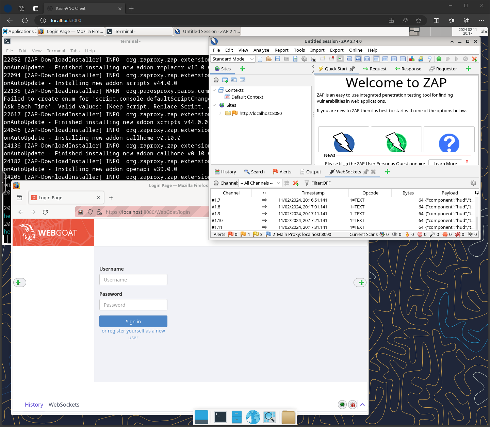
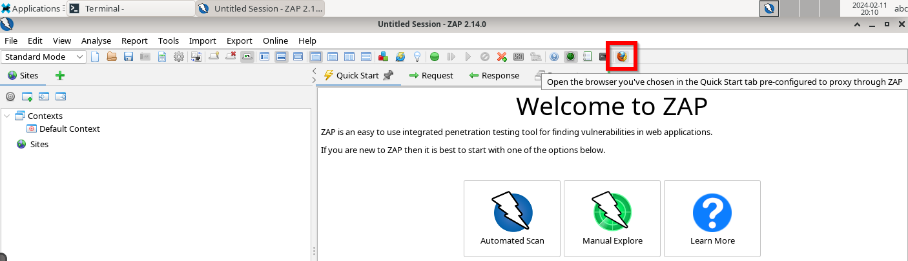

# WebGoat-ZAP

Dockerized WebGoat and ZAP in your browser.



## Usage

[Install Docker.](https://docs.docker.com/get-docker/)

### Docker cli

```bash
docker run --name webgoatzap -p 3000:3000 -e TZ=Europe/Helsinki -d ojarv/webgoat-zap:v1
```

### Docker Compose

```yaml
services:
    webgoatzap:
        container_name: webgoatzap
        environment:
            - TZ=Europe/Helsinki
        ports:
            - 3000:3000
        image: ojarv/webgoat-zap:v1
```

### Inside the container

1. Open the Webtop in your web browser:

    ```
    http://yourhost:3000
    ```

2. Open Terminal inside the virtual machine:

    Run the start script:

    ```bash
    $ /config/start.sh
    ```

3. Setup Firefox with ZAP:

    Launch Firefox with ZAP to automatically set up a ready-to-go profile with ZAP proxy applied in Firefox.

    

4. Access WebGoat:

    - WebGoat: [http://localhost:8080/WebGoat](http://localhost:8080/WebGoat)
    - WebWolf: [http://localhost:9090/WebWolf](http://localhost:9090/WebWolf)


## Build Instructions

1. Build the Docker image locally:

    Download [Dockerfile](Dockerfile)
    ```bash
    docker build -t webgoatzap .
    ```

2. Run the Docker container:

    ```bash
    docker run --name webgoatzap -p 3000:3000 -e TZ=Europe/Helsinki -d webgoatzap
    ```


## Credits

- [LinuxServer Webtop](https://github.com/linuxserver/docker-webtop)
- [OWASP WebGoat](https://github.com/WebGoat/WebGoat)
- [OWASP ZAP](https://www.zaproxy.org/)
